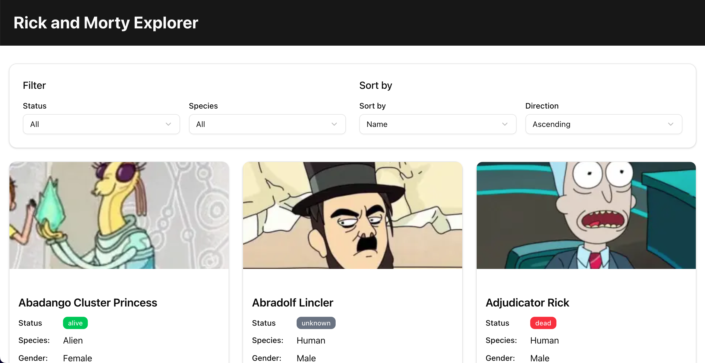

## Rick and Morty Character Explorer


## Setup Instructions

### Prerequisites

- Node.js 16.8 or later
- npm or yarn

### Installation

1. Clone the repository:
```bash
git clone https://github.com/yourusername/rick-and-morty-explorer.git
cd rick-and-morty-explorer
```

2. Install dependencies:
```bash
npm install or
# or
yarn
```

3. Run the development server:
```bash
npm run dev
# or
yarn dev
# or
pnpm dev
# or
bun dev
```

4. Open [http://localhost:3000](http://localhost:3000) with your browser to see the application.

### Techonologies Used

- **Next.js**: React framework for server-rendered applications
- **Apollo Client**: GraphQL client for data fetching
- **Tailwind CSS**: Utility-first CSS framework
- **shadcn/ui**: Reusable UI components built with Radix UI and Tailwind
- **TypeScript**: Type-safe JavaScript